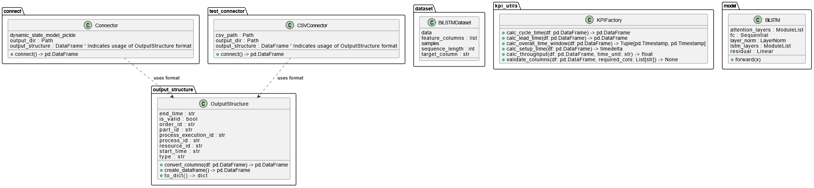

# ResNet-BiLSTM-Attention Digital Twin

A deep learning framework that combines Residual Networks (ResNet), Bidirectional Long Short-Term Memory (BiLSTM), and Attention mechanisms for validating manufacturing processes in Digital Twin applications.

## Overview

This project implements a hybrid deep learning architecture to analyze manufacturing data from CP Factory systems. It validates manufacturing processes by comparing real production data with simulated data from a digital twin to identify discrepancies and anomalies in process execution.



## Architecture

The model combines three advanced deep learning components:

1. **ResNet (Residual Network)**: Enables deep feature extraction while preventing vanishing gradients through skip connections
2. **BiLSTM (Bidirectional LSTM)**: Processes temporal sequences in both directions to capture manufacturing process dependencies
3. **Attention Mechanism**: Focuses the model on the most relevant parts of process sequences for improved prediction

## Dataset

The repository uses:

- Real factory data: `datasrc/real/real_factorydata.csv` and `real_factorydata_oclog.csv`
- Simulated data: `datasrc/sim/simulated_data_oclog.csv`

Data contains detailed manufacturing operations including:

- Process types and IDs
- Resource utilization and mapping
- Component and part information
- Timestamps and durations
- Order sequence information

## Features

- Process validation: Classification of valid vs. invalid manufacturing processes
- KPI calculation: Throughput, lead times, cycle times, setup times
- Feature engineering with time-based cyclical features (day of week, hour of day)
- Break detection (lunch breaks, night shifts)
- Holiday and weekend identification
- Baseline models (Decision Tree) and advanced deep learning models
- Visualization of model performance and validation metrics

## Hypothesis Testing Framework

This project features a comprehensive hypothesis testing framework to evaluate the quality of simulated data against real data, employing three complementary testing approaches:

### 1. Traditional Hypothesis Testing

Tests whether different SBDT (Structured Business Digital Twin) components can distinguish between real and simulated data using permutation tests:

```bash
python hypothesis_testing.py
```

Features:
- Calculates individual p-values for each testing run
- Averages p-values across multiple runs for stability
- Generates comprehensive visualizations of results
- Identifies which SBDT components are accurately modeled versus those that need improvement

### 2. Cauchy Combination Test (CCT)

A more robust testing approach that combines dependent p-values:

```bash
python run_cct.py --model both --runs 10 --permutations 1000
```

Key advantages:
- Handles dependent test statistics properly
- More powerful than traditional Bonferroni correction
- Provides a single combined p-value for more reliable decision-making
- Command line arguments for flexible configuration:
  - `--model`: Choose between `dt` (Decision Tree), `lstm` (BiLSTM), or `both`
  - `--runs`: Set number of runs with different random seeds
  - `--permutations`: Configure number of permutations for each test

### 3. Identical Data Testing

Validates the testing framework itself using identical data with different labels:

```bash
python run_identical_data_tests.py
```

This critical verification performs two complementary tests:
- **Real vs. Real (labeled as Sim)**: Expected to show no distinguishable difference
- **Sim vs. Sim (labeled as Real)**: Expected to show no distinguishable difference

These tests confirm that any differences detected in the main hypothesis tests are due to actual data characteristics, not testing artifacts.

### Test Components

The hypothesis testing framework analyzes these SBDT components:

- **Time Model**: Temporal features like durations and time patterns
- **Resource Model**: Machine and equipment utilization patterns
- **Transformation Model**: Process transformations and part relationship patterns
- **Transition Model**: State transitions between process steps
- **Process Model**: Overall process execution patterns
- **KPI-Based**: Key Performance Indicators like throughput and cycle times
- **All Features**: Combined analysis of all available features

Results from all testing approaches are stored in dedicated directories:
- `hypothesis_results/` - Standard and CCT hypothesis test results
- `identical_data_test_results/` - Identical data test results

## Requirements

- Python 3.12+
- UV package manager
- Dependencies as specified in pyproject.toml

## Installation

1. **Clone the repository:**

    ```bash
    git clone https://github.com/fishingpvalues/resnet-bilstm-attention-dt.git
    cd resnet-bilstm-attention-dt
    ```

2. **Set up the environment and install dependencies:** Choose **one** of the following methods:

    **Method A: Using UV (Recommended for exact reproducibility)**

    This method uses the `uv.lock` file to install the exact dependency versions.

    ```bash
    # Install UV if you don't have it
    # For Windows (PowerShell):
    # iwr -Uri https://astral.sh/uv/install.ps1 -useb | iex
    # For macOS/Linux:
    # curl -L --proto '=https' --tlsv1.2 -sSf https://astral.sh/uv/install.sh | sh

    # Create a virtual environment using uv
    uv venv

    # Activate the virtual environment
    # Linux/macOS:
    source .venv/bin/activate
    # Windows CMD:
    # .venv\Scripts\activate.bat
    # Windows PowerShell:
    # .venv\Scripts\Activate.ps1

    # Sync the environment using the uv.lock file
    uv sync
    ```

    **Method B: Using standard Python pip**

    This method uses `pyproject.toml` to install dependencies.

    ```bash
    # Create a virtual environment using Python's built-in venv
    python -m venv .venv

    # Activate the virtual environment
    # Linux/macOS:
    source .venv/bin/activate
    # Windows CMD:
    # .venv\Scripts\activate.bat
    # Windows PowerShell:
    # .venv\Scripts\Activate.ps1

    # Upgrade pip
    pip install --upgrade pip

    # Install the project and its dependencies from pyproject.toml
    pip install -e .
    ```

## Usage

### Main Pipeline

Run the main pipeline which executes both the Decision Tree baseline and BiLSTM models:

```bash
python main.py
```

This executes:
- **Baseline Pipeline (Decision Tree):** Fast traditional classification approach
- **Advanced Pipeline (ResNet-BiLSTM-Attention):** Deep neural network using BiLSTM with attention mechanisms (uses CUDA if available)

### Hypothesis Testing

1. **Traditional hypothesis testing**:
   ```bash
   python hypothesis_testing.py
   ```

2. **Cauchy Combination Test (CCT)**:
   ```bash
   # Run with both models (DT and BiLSTM)
   python run_cct.py --model both

   # Run only with Decision Tree model (faster)
   python run_cct.py --model dt --permutations 1000

   # Run only with BiLSTM model (more powerful)
   python run_cct.py --model lstm --runs 5 --permutations 500
   ```

3. **Identical data testing**:
   ```bash
   python run_identical_data_tests.py
   ```

## Model Details

### Decision Tree

- Serves as a fast baseline model
- Advantages:
  - Quick training and inference
  - Easily interpretable results
  - Effective at capturing time-based patterns

### ResNet-BiLSTM-Attention Network

- Hybrid deep learning architecture
- Key features:
  - ResNet components extract hierarchical features
  - BiLSTM processes sequential patterns in both directions
  - Attention mechanism focuses on most relevant sequence segments
- Performance characteristics:
  - Typically converges within 10 epochs
  - Superior pattern recognition compared to baseline models
  - More effective at capturing complex temporal dependencies

## Visualization and Analysis

The repository includes comprehensive visualization capabilities:
- ROC curves and confusion matrices
- Feature importance plots
- Permutation test null distributions
- Comparative performance across SBDT components
- P-value plots showing statistical significance
- Rejection rate visualizations

## File Structure

```text
ResNet-BiLSTM-Attention-DT/
├── README.md                    <— This documentation
├── LICENSE                      <— Project license
├── main.py                      <— Entry point for running the main pipeline
├── run_cct.py                   <— Script for Cauchy Combination Test
├── run_identical_data_tests.py  <— Script for identical data hypothesis testing
├── hypothesis_testing_twosampletest.py <— Traditional hypothesis testing implementation
├── hypothesis_testing_cct.py    <— CCT hypothesis testing implementation
├── BiLSTM_model.pth             <— Saved model weights
├── classes.png                  <— Architecture diagram
├── pyproject.toml               <— Project dependencies
├── uv.lock                      <— Locked dependencies for reproducibility
│
├── datasrc/                     <— Source data files
│   ├── real/                    <— Real factory data
│   │   ├── real_factorydata.csv
│   │   ├── real_factorydata_oclog.csv
│   │   ├── part_mapping.json    <— Mapping files for data processing
│   │   └── ...
│   └── sim/                     <— Simulated digital twin data
│       └── simulated_data_oclog.csv
│
├── src/                         <— Source code
│   ├── hypothesis_testing.py    <— Standard hypothesis testing implementation
│   ├── validate.ipynb           <— Validation notebook
│   ├── connector/               <— External system connectors
│   ├── models/                  <— Model implementations
│   │   ├── resnet_bilstm_attn/  <— Deep learning model
│   │   │   ├── model.py         <— BiLSTM model architecture
│   │   │   ├── dataset.py       <— Dataset processing for BiLSTM
│   │   │   └── dataset_hypothesistesting.py <— Testing-specific dataset
│   │   └── decisiontree/        <— Baseline model
│   │       └── baseline.py      <— Decision Tree implementation
│   ├── data/                    <— Data processing utilities
│   │   ├── featureeng.py        <— Feature engineering
│   │   ├── filter.py           <— Data filtering
│   │   └── preprocessing.py     <— Data preprocessing
│   └── utils/                   <— Helper utilities
│       ├── config.py           <— Configuration utilities
│       └── reporting.py        <— Visualization and metrics reporting
│
├── hypothesis_results/          <— Standard hypothesis test results
│   ├── dt/                      <— Decision tree results
│   │   ├── dt_p_values.png      <— P-value visualizations
│   │   ├── dt_rejection_rates.png <— Rejection rate charts 
│   │   └── dt_roc_auc_by_component.png <— ROC AUC metrics by component
│   └── lstm/                    <— BiLSTM results
│       ├── lstm_p_values.png    <— P-value visualizations
│       └── component_run#_permutation_test.png <— Permutation test results
│
├── identical_data_test_results/ <— Results from identical data tests
│   ├── real_dt/                 <— Decision tree on identical real data
│   ├── real_lstm/               <— BiLSTM on identical real data
│   ├── sim_dt/                  <— Decision tree on identical simulated data
│   ├── sim_lstm/                <— BiLSTM on identical simulated data
│   ├── dt_summary_*.txt         <— Summary results for DT tests
│   ├── lstm_summary_*.txt       <— Summary results for LSTM tests
│   └── *_roc_auc_comparison.png <— ROC AUC comparison visualizations
│
└── decision_tree/               <— Decision tree related resources
    └── decision_tree.pdf        <— Decision tree visualization
```

## Research Background

This project implements a novel approach to digital twin validation using statistical hypothesis testing. Traditional approaches often rely on subjective assessments, while our method provides rigorous statistical evidence for the quality of digital twin simulations across different aspects of manufacturing processes.

The combination of traditional hypothesis testing with the Cauchy Combination Test represents a state-of-the-art approach to handling multiple dependent hypothesis tests in manufacturing validation.

## Related Academic Work

This project was developed as part of the following academic research:

Your Full Name. (2025). *Digital Twin Validation Through Deep Learning and Statistical Hypothesis Testing*. [PhD/Master's Thesis, Your University Name]. 
Repository link: https://repository.university.edu/thesis/identifier

For a detailed explanation of the methodology and theoretical background, please refer to the thesis.

## Citation Information

### BibTeX

```
@software{ResNet-BiLSTM-Attention-DT,
  author = {Your Full Name},
  title = {ResNet-BiLSTM-Attention Digital Twin: A Framework for Validating Manufacturing Process Simulations},
  year = {2025},
  month = {4},
  version = {1.0.0},
  publisher = {Your University or Institution},
  url = {https://github.com/fishingpvalues/resnet-bilstm-attention-dt},
  doi = {10.5281/zenodo.xxxxxxx}
}

@phdthesis{YourThesis2025,
  author = {Your Full Name},
  title = {Digital Twin Validation Through Deep Learning and Statistical Hypothesis Testing},
  school = {Your University Name},
  year = {2025},
  address = {City, Country},
  month = {April},
  doi = {10.xxxx/xxxxx}
}
```

### APA Style

Your Full Name. (2025). *ResNet-BiLSTM-Attention Digital Twin: A Framework for Validating Manufacturing Process Simulations* (Version 1.0.0) [Computer software]. Your University or Institution. https://doi.org/10.5281/zenodo.xxxxxxx

## Community and Support

- **Issues and Bugs**: Please report any issues through the [GitHub issue tracker](https://github.com/fishingpvalues/resnet-bilstm-attention-dt/issues)
- **Contributions**: See [CONTRIBUTING.md](CONTRIBUTING.md) for guidelines on how to contribute
- **Code of Conduct**: All contributors are expected to adhere to our [Code of Conduct](CODE_OF_CONDUCT.md)
- **Version History**: See [CHANGELOG.md](CHANGELOG.md) for a history of changes

## License

This project is licensed under the MIT License - see the [LICENSE](LICENSE) file for details.
